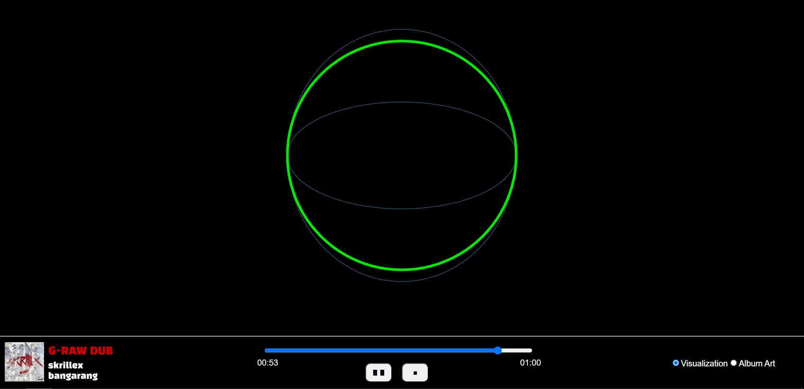
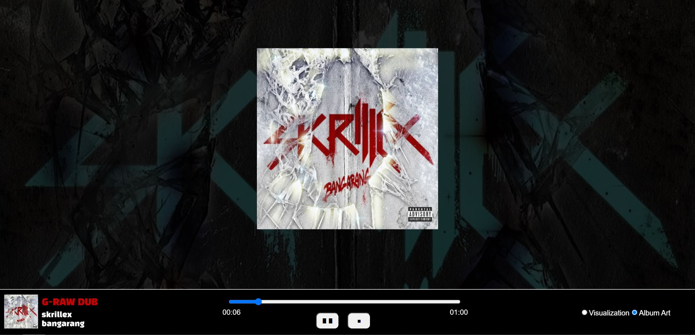

# ReadMe - HW08B Working Document

🎵 Earphones recommended for the best experience 🎵

This assignment was based around visualizing sound by utilizing the p5.Sound library. I've made use of the *getPeaks()* function to visualize sound samples in real-time as the audio progresses.

I have modeled my assignment to look like a media player, complete with media controls, album art, and album metadata. The media player gives the user a choice between two different type of visualizations: **audioforms** or **album art**. These choices are available in the form of *radio buttons*.

One of my absolute favorite electronic artist is *Skrillex*, and hence, for this assignment, I've chosen an audio sample from one of his albums. In order to visualize all the samples, I've made use of the p5.Sound function *getPeaks()*. Once all this information is stored onto a variable, I've coded in a functionality to separately map all the different amplitudes, i.e. I'm extracting the audio's highs, mids & lows individually, and then using that information to generate shapes for the dynamic visualizer.

```
vizRad_Highs = map(soundWaveForms[soundIndex], 0.2, 1, -height/3, height/3);
vizRad_Mids = map(soundWaveForms[soundIndex], 0.05, 0.2, -height/5, height/5);
vizRad_Lows = map(soundWaveForms[soundIndex], -1, 0.05, -height/10, height/10);

if(currentTimeStamp>=49.1)
{
  //generating getPeaks() visualizer post drop
  stroke(random(0,256), random(0,256), random(0,256), random(100,200));
  noFill();
  ellipse(width/2, height/2.5, 2*vizRad_Highs, 2*vizRad_Lows);
  ellipse(width/2, height/2.5, 2*vizRad_Highs, 2*vizRad_Mids);
}

noFill();
strokeWeight(5);

//generating getPeaks()-mapped ellipses for visualizer
if(soundWaveForms[soundIndex]<=0.05)
{
  stroke(random(100,256),0,0);
  ellipse(width/2, height/2.5, 2*vizRad_Lows);
}
else if(soundWaveForms[soundIndex]>0.05 && soundWaveForms[soundIndex]<=0.2)
{
  stroke(0,0,random(100,256));
  ellipse(width/2, height/2.5, 2*vizRad_Mids);
}
else
{
  stroke(0,random(100,256),0);
  ellipse(width/2, height/2.5, 2*vizRad_Highs);
}
```

The user can choose whichever visualization they'd like to view by making use of the DOM-based radio buttons:
<p align = "center">

<br>
Figure 1.1: Audio Visualization Mode
<br>
<br>

<br>
Figure 1.2: Album Art Mode </p>

I've made use of the DOM slider to create a "seek-bar" in real-time. It updates according to the audio's current timestamp. Additionally, the button actions are interactive, and I've made use of *classes* to generate multiple buttons having similar properties. The Album Art Mode makes use of an image as a stylized background, and I've made use of *filter()* to generate some snazzy UI designs which incorporate some image manipulation.

In order to make the experience more enjoyable, I've coded in several effects that are synced to the song, and ultimately enhance the *getPeaks()*-enabled visualizations.